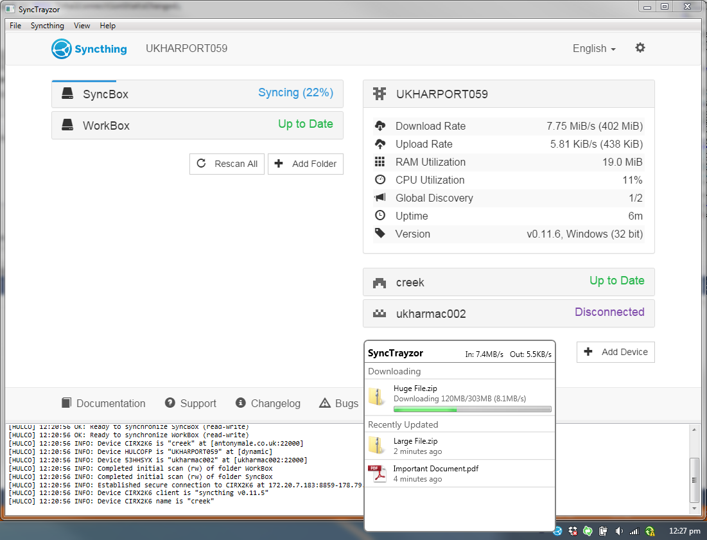

SyncTrayzor 
===========

[Download and install SyncTrayzor now](#installation).

Introduction
------------

SyncTrayzor is a little tray utility for [Syncthing](http://syncthing.net/) on Windows.
It hosts and wraps Syncthing, making it behave more like a native Windows application and less like a command-line utility with a web browser interface.

Features include:

 - Has a built-in web browser, so you don't need to fire up an external browser.
 - Optionally starts on login, so you don't need to set up Syncthing as a service.
 - Has drop-box style file download. progress window
 - Can watch your folders for changes, so you don't have to poll them frequently:
    - Syncthing on its own has to poll your folders, in order to see if any files have changed.
    - SyncTrayzor will watch your folders for changes, and alert Syncthing the second anything changes.
    - This means you can increase the polling interval in Syncthing, avoiding the resource usage of high-frequency polling, but still have any changes propagated straight away.
    - Folder watching respects the ignores configured in Syncthing.
 - Tray icon indicates when synchronization is occurring.
 - Optional tray messages when folders have finished syncing.
 - Contains translations for 13 languages.

Installation
------------

SyncTrayzor is packaged as both an installer and a standalone zip. It will run on Windows Vista, 7, and 8, and 10.

### Installer

[Download `SyncTrayzorSetup-x64.exe` or `SyncTrayzorSetip-x86.exe`](https://github.com/canton7/releases/latest) and run it.
If you already have SyncTrayzor installed, this will update it.

### Standalone

First, you'll need .net 4.5. [Download the offline](http://www.microsoft.com/en-gb/download/details.aspx?id=42642) or
[web installer](http://www.microsoft.com/en-gb/download/details.aspx?id=42643) if you don't have it installed already.

[Download `SyncTrayzorPortable-x64.zip` or `SyncTrayzorPortable-x86.zip`](https://github.com/canton7/releases/latest) .
Unzip, and run `SyncTrayzor.exe`. If you're updating, you'll need to copy the `data` folder across from your previous standalone installation.

Something went wrong!
---------------------

First, what went wrong? Remember that SyncTrayzor is a wrapper around [Syncthing](http://github.com/syncthing/syncthing).
Syncthing is the file synchronization program, which has a web interface.
SyncTrayzor is the tray utility, looks like a normal Windows program, and has menus and suchlike, and a big area where Syncthing's web interface is displayed.

 - If you're having problems connecting to other devices, your files aren't synchronizing, or you're getting error messages in the console area, [raise an issue with Syncthing](http://github.com/syncthing/syncthing) or [post on the Syncthing forums](http://discourse.syncthing.net).
 - If SyncTrayzor isn't talking to Syncthing, you're getting error dialogs, it's not auto-starting, etc, [raise an issue with SyncTrayzor](http://github.com/canton7/SyncTrayzor).
 - If you're not sure, raise an issue here and I'll redirect you if appropriate.

Contributing
------------

Multi-lingual? SyncTrayzor needs you! Please read [Localization](https://github.com/canton7/SyncTrayzor/wiki/Localization).

Want to make a contribution? Fantastic, and thank you! Please read [Contributing](https://github.com/canton7/SyncTrayzor/wiki/Contributing) first.

Will SyncTrayzor phone home / give away my secrets / etc?
---------------------------------------------------------

SyncTrayzor's auto-update mechanism will periodically call a script (found in `server/version_check.php`, hosted on a server of mine) to find out if there's an upgrade available.
It will disclose your current SyncTrayzor version, and the package you downloaded (installer/portable and x64/x86).
It will also reveal your IP address, which is unavoidable.

You can turn off auto-updates in the Settings, but in that case you are responsible for manually checking for updates.

Usage information, details of your computer / network / syncthing setup / etc are not reported.

How can I be sure that I'm not downloading a virus?
---------------------------------------------------

You can be paranoid and build everything from source (after auditing the source), or you can trust that I'm a good person who's trusted by the Syncthing developers.

You can verify that this GitHub account hasn't been compromised and is releasing malicious downloads by following the steps in the [Security README](https://github.com/canton7/SyncTrayzor/tree/master/security).
This process also lets you verify that Syncthing's developers trust me to release non-malicious software.

What will SyncTrayzor do to Syncthing?
--------------------------------------

It's worth noting that SyncTrayzor will override the 'GUI Listen Address' and 'API Key' in Syncthing's configuration.
This is because it needs to fully control these values, in order to ensure that it can communicate with Syncthing.

However, you can set these values in File -> Settings, if you want to customise them.

What will SyncTrayzor do to my system?
--------------------------------------

Good question. The answer depends on whether you installed SyncTrayzor using the installer, or are running it standalone.

### Installed

SyncTrayzor will install itself into `C:\Program Files\SyncTrayzor`. 

By default, SyncTrayzor will put its own configuration in `C:\Users\<You>\AppData\Roaming\SyncTrayor`, and let Syncthing use its default folder for its database, which is `C:\Users\<You>\AppData\Local\Syncthing`.
It will also create a registry key at `HKEY_CURRENT_USER\Software\Microsoft\Windows\CurrentVersion\Run\SyncTrayzor` the first time that it is run, which will let it start when you log in.

You can delete this registry key by unchecking "Automatically start on login" in the settings.

If you uncheck "Use Syncthing's default database location" in the settings, then SyncTrayzor will tell Syncthing to use `C:\Users\<You>\AppData\Local\SyncTrayzor\syncthing` for its database.
This is useful if you want to keep the copy of Syncthing managed by SyncTrayzor separate from another copy running on your machine.

The auto-update mechanism may download updates to `%TEMP%\SyncTrayzor`. This location is periodically cleared out (once every few days).

### Portable

SyncTrayzor will put its own configuration in `SyncTrayzorPortable\data`, and tell Syncthing to use `SyncTrayzorPortable\data\syncthing` for its database.
This means that, when upgrading, you can simply move the 'data' folder over to move all your settings, and database.
If you uncheck "Use custom home directory or Syncthing" in the settings, then Syncthing will use its default folder for its database, which is `C:\Users\<You>\AppData\Local\Syncthing`.

The portable version won't start on login by default. If you check "Automatically start on login" in the settings, then a registry key will be created at `HKEY_CURRENT_USER\Software\Microsoft\Windows\CurrentVersion\Run\SyncTrayzor`.

Using Syncthing beta releases
-----------------------------

### Installed

SyncTrayzor keeps two copies of syncthing.exe.

The copy that is executed is at `C:\Users\<You>\AppData\Local\SyncTrayzor\syncthing.exe`.
This one is writable by the user, allowing Syncthing to auto-upgrade.

There's also a backup copy in `C:\Program Files\SyncTrayzor\syncthing.exe`.
This one is copied to `C:\Users\<You>\AppData\Local\SyncTrayzor\syncthing.exe` if that one does not exist (SyncTrayzor has never been run before for that user, for example).

If you want to manually upgrade (e.g. to a beta version) you should download Syncthing from [the releases page](https://github.com/syncthing/syncthing/releases), and replace the `syncthing.exe` in `C:\Users\<You>\AppData\Local\SyncTrayzor`.

### Portable

SyncTrayzor keeps a single version of `syncthing.exe`, next to `SyncTrayzor.exe`.

If you want to manually upgrade (e.g. to a beta version) you should download Syncthing from [the releases page](https://github.com/syncthing/syncthing/releases), and replace this `syncthing.exe`.

Building from Source
--------------------

You'll need [Visual Studio 2015](https://www.visualstudio.com/en-us/downloads/download-visual-studio-vs.aspx).
Clone/download the repository, open `src\SyncTrayzor.sln`, and compile.
You'll also need to [download syncthing.exe](https://github.com/syncthing/syncthing/releases) and place it in the `bin\x86\Debug`, `bin\x64\Debug`, `bin\x86\Release`, or `bin\x64\Release` folder as appropriate.
